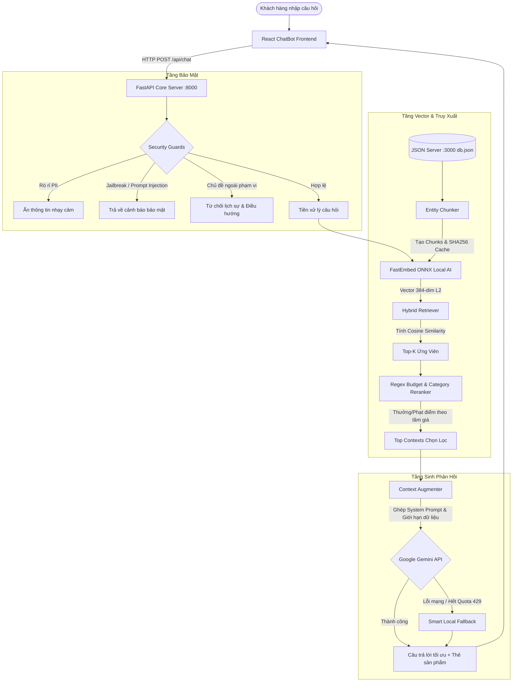

# BÁO CÁO KỸ THUẬT: KIẾN TRÚC HỆ THỐNG RAG (RETRIEVAL-AUGMENTED GENERATION) - HCORE COMPUTER

> **Phiên bản:** 2.0.0 (Modular & Local AI Architecture)  
> **Dự án:** HCore E-Commerce Platform (`TMDT_DALN`)  
> **Sơ đồ kiến trúc tương tác:** [rag-architecture.html](file:///d:/TMDT_DALN/rag_service/rag-architecture.html) *(Mở trực tiếp bằng trình duyệt để xem sơ đồ SVG có tương tác, chuyển Dark/Light theme)*

---

## MỤC LỤC
1. [Tổng Quan Hệ Thống & Triết Lý Thiết Kế](#1-tổng-quan-hệ-thống--triết-lý-thiết-kế)
2. [Cấu Trúc Thư Mục Chuẩn Hóa (`rag_service/`)](#2-cấu-trúc-thư-mục-chuẩn-hóa-rag_service)
3. [Luồng Xử Lý Toàn Diện (End-to-End Pipeline)](#3-luồng-xử-lý-toàn-diện-end-to-end-pipeline)
4. [Chi Tiết Thuật Toán & Kỹ Thuật Phân Đoạn (Chunking Strategy)](#4-chi-tiết-thuật-toán--kỹ-thuật-phân-đoạn-chunking-strategy)
5. [Mô Hình Local AI Embedding & Chuẩn Hóa Vector ($L_2$ Normalization)](#5-mô-hình-local-ai-embedding--chuẩn-hóa-vector-l_2-normalization)
6. [Hệ Thống 3 Tầng Bảo Mật (Security Guardrails)](#6-hệ-thống-3-tầng-bảo-mật-security-guardrails)
7. [Truy Xuất Hai Giai Đoạn & Xếp Hạng Ngân Sách (Hybrid Retrieval & Reranking)](#7-truy-xuất-hai-giai-đoạn--xếp-hạng-ngân-sách-hybrid-retrieval--reranking)
8. [Tăng Cường Ngữ Cảnh & Cơ Chế Dự Phòng Ngoại Tuyến (Generation & Smart Fallback)](#8-tăng-cường-ngữ-cảnh--cơ-chế-dự-phòng-ngoại-tuyến-generation--smart-fallback)
9. [Hướng Dẫn Kiểm Thử & Vận Hành](#9-hướng-dẫn-kiểm-thử--vận-hành)

---

## 1. TỔNG QUAN HỆ THỐNG & TRIẾT LÝ THIẾT KẾ

Hệ thống RAG của HCore là dịch vụ thông minh hỗ trợ tư vấn bán hàng chuyên sâu về linh kiện máy tính, laptop, màn hình và phụ kiện công nghệ. Khác với các Chatbot thông thường (chỉ gửi prompt thẳng lên mô hình ngôn ngữ lớn), HCore RAG giải quyết triệt để 3 bài toán lớn của thương mại điện tử:

1. **Chống Ảo Giác (Anti-Hallucination):** LLM chỉ được phép tư vấn các sản phẩm, giá bán, tồn kho và chính sách có thật trong cơ sở dữ liệu của cửa hàng.
2. **Bảo Mật & Tuân Thủ (Security & Compliance):** Ngăn chặn 100% các cuộc tấn công chiếm quyền điều khiển câu lệnh (Prompt Injection / DAN Attack), che giấu thông tin định danh cá nhân (PII), và từ chối các chủ đề ngoài phạm vi bán hàng.
3. **Hiệu Năng Cao & Tính Sẵn Sàng 100% (High Availability):**
   - **Local AI Embedding:** Sử dụng mô hình Vector cục bộ chạy qua ONNX Runtime, hoàn toàn ngoại tuyến, thời gian sinh vector chỉ từ 10 - 20ms, không phụ thuộc kết nối Internet và không tốn chi phí gọi API.
   - **Smart Local Fallback:** Nếu mạng gặp sự cố hoặc Gemini API quá tải (Rate limit 429), Chatbot tự động kích hoạt bộ sinh phản hồi theo mẫu cục bộ dựa trên dữ liệu sản phẩm đã truy xuất, đảm bảo người dùng không bao giờ gặp lỗi gián đoạn.

---

## 2. CẤU TRÚC THƯ MỤC CHUẨN HÓA (`rag_service/`)

Trước đây, toàn bộ logic bị dồn vào một file đơn lẻ gây khó khăn cho việc bảo trì và mở rộng. Hệ thống đã được tái cấu trúc thành kiến trúc đa tầng (Layered Modular Architecture) tuân thủ nguyên lý Đơn nhiệm (Single Responsibility Principle):

```
d:/TMDT_DALN/rag_service/
├── config.py                  # [Cấu hình] Quản lý biến môi trường, cổng mạng, API key và siêu tham số
├── knowledge.py               # [Tri thức] Lưu trữ chính sách cửa hàng và nạp dữ liệu song song từ db.json
├── chunker.py                 # [Phân đoạn] Thuật toán Entity-based Semantic Chunking + Fingerprint Cache
├── embeddings.py              # [Vector hóa] Local AI ONNX FastEmbed (MiniLM-L12, 384 chiều) + Chuẩn hóa L2
├── retriever.py               # [Truy xuất] Cosine Similarity qua Dot Product + Regex Budget/Category Reranker
├── guards.py                  # [Bảo mật] 3 tầng phòng thủ: PII Masking, Jailbreak Blocker, Off-topic Filter
├── engine.py                  # [Điều phối] Nhạc trưởng trung tâm RAG Engine liên kết toàn bộ các tầng
├── rag_engine.py              # [Tương thích] Wrapper re-export đảm bảo 100% tương thích ngược
├── main.py                    # [REST API] FastAPI server (:8000), định tuyến endpoints /api/chat, /api/health
├── rag-pipeline.architecture.json # [Đặc tả kiến trúc] Định nghĩa máy trạng thái theo chuẩn Archify
├── rag-architecture.html      # [Sơ đồ tương tác] Giao diện SVG động độc lập với đầy đủ views và cards
└── RAG_ARCHITECTURE.md        # [Tài liệu] Bản báo cáo chi tiết kỹ thuật này
```

---

## 3. LUỒNG XỬ LÝ TOÀN DIỆN (END-TO-END PIPELINE)

Quy trình xử lý một câu hỏi của khách hàng diễn ra qua các bước tuần tự được kiểm soát chặt chẽ:



---

## 4. CHI TIẾT THUẬT TOÁN & KỸ THUẬT PHÂN ĐOẠN (CHUNKING STRATEGY)

### 4.1. Tại sao KHÔNG sử dụng Fixed Character/Token Chunking?
Trong các bài toán xử lý tài liệu văn bản dài (sách, bài báo), người ta thường dùng kỹ thuật cắt đoạn cố định theo số ký tự (như `RecursiveCharacterTextSplitter` cắt mỗi 500 ký tự với overlap 50 ký tự). 

Tuy nhiên, **trong thương mại điện tử, áp dụng cách này là một sai lầm nghiêm trọng**:
- **Nguy cơ xé nhỏ thực thể:** Một sản phẩm laptop có thể bị cắt làm đôi: nửa đầu chứa tên máy (`Dell XPS 15`), nửa sau chứa giá bán (`35.000.000đ`) và card đồ họa. Khi đó, vector tìm kiếm sẽ mất ngữ cảnh, khiến mô hình báo nhầm giá hoặc gán nhầm thông số của máy này sang máy khác.
- **Mất liên kết thuộc tính:** Người dùng hỏi *"tìm laptop RAM 16GB dưới 20 triệu"*, nếu RAM ở chunk 1 và giá tiền ở chunk 2, hệ thống truy xuất sẽ không thể đánh giá chính xác độ tương đồng của cả sản phẩm.

### 4.2. Giải pháp: Phân đoạn ngữ nghĩa theo thực thể (Entity-based Semantic Chunking)
HCore áp dụng thuật toán phân đoạn theo từng thực thể hoàn chỉnh:
- **Nguyên tắc:** Mỗi sản phẩm hoặc mỗi chính sách cửa hàng là **một đơn vị tri thức nguyên tử (Atomic Knowledge Unit)**.
- **Cấu trúc Chunk chuẩn hóa:**
  ```python
  text_representation = (
      f"Sản phẩm: {item['name']}\n"
      f"Danh mục: {category_label} | Mã: {item['id']}\n"
      f"Giá bán: {formatted_price} (Nguyên bản: {price_num} VNĐ)\n"
      f"Thông số kỹ thuật & Cấu hình: {specs_summary}\n"
      f"Đặc điểm nổi bật: {item.get('description', 'Đang cập nhật')}\n"
      f"Tình trạng kho hàng: Còn hàng - Sẵn sàng giao ngay\n"
      f"Đường dẫn chi tiết: {product_url}"
  )
  ```
- **Metadata đi kèm từng Chunk:**
  ```python
  metadata = {
      "id": item["id"],
      "name": item["name"],
      "price": price_num,
      "category": category_slug,
      "type": "product", # hoặc "store_policy"
      "url": product_url
  }
  ```

### 4.3. Cơ Chế Bộ Nhớ Đệm Dấu Vân Tay (Fingerprint Hashing Cache)
Để tránh việc tính toán lại vector lặp đi lặp lại tốn tài nguyên CPU:
1. Khi nạp dữ liệu từ `knowledge.py`, hệ thống tính chuỗi băm SHA-256 trên nội dung thô:
   $$\text{Hash} = \text{SHA256}(\text{Catalog Content})$$
2. Nếu `Hash` không đổi so với lần chạy trước, hệ thống tái sử dụng toàn bộ Vector Matrix trong RAM mà không cần gọi lại model embedding.
3. Nếu dữ liệu trong `db.json` thay đổi (thêm sản phẩm mới hoặc đổi giá), hệ thống phát hiện lệch Hash và tự động kích hoạt cập nhật vector trong nền (Background Vector Ingestion).

---

## 5. MÔ HÌNH LOCAL AI EMBEDDING & CHUẨN HÓA VECTOR ($L_2$ NORMALIZATION)

### 5.1. Lựa Chọn Mô Hình: FastEmbed ONNX
Hệ thống sử dụng mô hình mã nguồn mở tối ưu cho đa ngôn ngữ:
- **Tên mô hình:** `sentence-transformers/paraphrase-multilingual-MiniLM-L12-v2`
- **Thời gian thực thi:** Chạy trực tiếp trên CPU thông qua Open Neural Network Exchange (ONNX Runtime) với các nhân tính toán C++ tối ưu hóa vector AVX2/AVX-512.
- **Kích thước vector:** $d = 384$ chiều (Float32).
- **Hỗ trợ tiếng Việt:** Hiểu sâu sắc ngữ nghĩa tiếng Việt có dấu, không dấu, từ viết tắt công nghệ (`ram`, `card màn hình`, `vga`, `ssd`, `màn 2k`).

### 5.2. Thuật Toán Chuẩn Hóa $L_2$ (L2 Normalization)
Khoảng cách Cosine giữa vector truy vấn $\mathbf{q}$ và vector tài liệu $\mathbf{d}$ được định nghĩa:
$$\text{CosineSimilarity}(\mathbf{q}, \mathbf{d}) = \frac{\mathbf{q} \cdot \mathbf{d}}{\|\mathbf{q}\|_2 \|\mathbf{d}\|_2} = \frac{\sum_{i=1}^{d} q_i d_i}{\sqrt{\sum_{i=1}^{d} q_i^2} \sqrt{\sum_{i=1}^{d} d_i^2}}$$

Nếu tính toán căn bậc hai và phép chia này cho hàng ngàn sản phẩm trong mỗi lượt hỏi thì sẽ rất chậm. Vì vậy, HCore áp dụng chiến lược **Chuẩn hóa trước (Pre-normalization)**:

Mỗi vector $\mathbf{v}$ ngay khi sinh ra đều được đưa về độ dài đơn vị ($\|\mathbf{v}\|_2 = 1$):
$$\mathbf{v}_{\text{norm}} = \frac{\mathbf{v}}{\sqrt{\sum_{i=1}^{384} v_i^2 + \epsilon}} \quad (\text{với } \epsilon = 10^{-12})$$

Nhờ đó, khi người dùng gửi câu hỏi, khoảng cách Cosine được rút gọn thành một phép **Nhân vô hướng (Dot Product)** ma trận đơn giản:
$$\text{CosineSimilarity}(\mathbf{q}_{\text{norm}}, \mathbf{d}_{\text{norm}}) = \mathbf{q}_{\text{norm}} \cdot \mathbf{d}_{\text{norm}} = \sum_{i=1}^{384} q_{\text{norm}, i} \cdot d_{\text{norm}, i}$$

Phép tính này đạt tốc độ **< 2 mili-giây** trên CPU cho toàn bộ cơ sở dữ liệu cửa hàng.

---

## 6. HỆ THỐNG 3 TẦNG BẢO MẬT (SECURITY GUARDRAILS)

Trước khi bất kỳ câu hỏi nào được đưa vào bộ truy xuất vector, nó phải vượt qua 3 lớp phòng thủ độc lập trong `guards.py`:

```
┌────────────────────────────────────────────────────────────────────────┐
│                        Khách hàng gửi câu hỏi                         │
└───────────────────────────────────┬────────────────────────────────────┘
                                    │
                                    ▼
       ┌──────────────────────────────────────────────────────────┐
       │ Tầng 1: PII Masking                                     │
       │ Phát hiện số thẻ Visa/Master, CMND/CCCD, SĐT cá nhân    │
       │ Thay thế bằng [THÔNG TIN ĐÃ ĐƯỢC ẨN VÌ BẢO MẬT]         │
       └────────────────────────────┬─────────────────────────────┘
                                    │
                                    ▼
       ┌──────────────────────────────────────────────────────────┐
       │ Tầng 2: Jailbreak & Prompt Injection Defense             │
       │ Chặn từ khóa: "ignore previous instructions", "DAN mode",│
       │ "system prompt", "bỏ qua câu lệnh trước", "hãy đóng vai" │
       └────────────────────────────┬─────────────────────────────┘
                                    │
                                    ▼
       ┌──────────────────────────────────────────────────────────┐
       │ Tầng 3: Out-of-Domain Filter                            │
       │ Nhận diện câu hỏi thời tiết, chính trị, code python,    │
       │ giải toán, triết học không thuộc phạm vi cửa hàng        │
       └────────────────────────────┬─────────────────────────────┘
                                    │
                                    ▼
                        [Câu hỏi an toàn & hợp lệ]
```

1. **PII Masking (Bảo vệ dữ liệu cá nhân):** Dùng biểu thức chính quy (Regex) quét số thẻ thanh toán quốc tế (Luhn algorithm pattern), số thẻ nội địa, và số điện thoại để che giấu trước khi ghi log hoặc gửi ra LLM bên ngoài.
2. **Jailbreak Defense (Chống tấn công Prompt):** Chặn các mẫu câu cố tình vượt rào (bypass guardrails), yêu cầu đóng vai hoặc ép AI tiết lộ prompt nội bộ.
3. **Off-topic Filter (Lọc ngoài phạm vi):** Nhận diện các câu hỏi không liên quan đến công nghệ, phần cứng, mua sắm để trả lời từ chối lịch sự và hướng người dùng quay lại danh mục sản phẩm của HCore.

---

## 7. TRUY XUẤT HAI GIAI ĐOẠN & XẾP HẠNG NGÂN SÁCH (HYBRID RETRIEVAL & RERANKING)

Một trong những vấn đề lớn nhất của việc tìm kiếm thuần túy bằng vector ngữ nghĩa (Pure Vector Search) là **mù mờ về mặt số học (Numerical Blindness)**.
Ví dụ: Người dùng hỏi *"Tư vấn laptop dưới 15 triệu"*, mô hình vector có thể trả về các sản phẩm laptop có mô tả rất giống nhưng giá là `25.000.000đ` vì từ khóa `laptop` có điểm tương đồng từ vựng cao.

Để giải quyết triệt để, HCore thiết kế quy trình **Truy xuất hai giai đoạn (Two-stage Retrieval)**:

### Giai đoạn 1: Dense Semantic Retrieval
Lấy Top-$N$ ($N = 12$) sản phẩm có độ tương đồng Cosine cao nhất với câu hỏi.

### Giai đoạn 2: Regex Budget & Category Reranker
Bóc tách ngữ nghĩa số học trong câu hỏi bằng hệ thống Regex tiếng Việt chuyên dụng:
- **Phát hiện ngân sách tối đa:** Quét các cụm từ như `dưới 15tr`, `< 20 triệu`, `tối đa 18tr`, `không quá 12 triệu`.
- **Phát hiện khoảng ngân sách mục tiêu:** Quét các cụm từ như `tầm 15 đến 20tr`, `khoảng 10-15 triệu`, `tầm 20 củ`.
- **Phát hiện danh mục ưu tiên:** Bóc tách từ khóa chuyên ngành (`laptop`, `vga`, `card`, `ram`, `ssd`, `màn hình`, `chuột`, `bàn phím`, `tai nghe`).

**Công thức tính điểm xếp hạng lại (Rerank Score):**
$$\text{Score}_{\text{final}} = \text{Score}_{\text{cosine}} + \Delta_{\text{budget}} + \Delta_{\text{category}}$$

Trong đó:
- Nếu sản phẩm **thỏa mãn ngân sách tối đa** (ví dụ: giá $\le 15.000.000đ$): $\Delta_{\text{budget}} = +0.25$
- Nếu sản phẩm **vượt quá ngân sách** khách yêu cầu: $\Delta_{\text{budget}} = -0.40$ (đẩy lùi về cuối danh sách)
- Nếu sản phẩm **nằm đúng trong dải ngân sách mục tiêu** ($\pm 15\%$): $\Delta_{\text{budget}} = +0.20$
- Nếu sản phẩm **khớp chính xác danh mục** người dùng đang tìm kiếm: $\Delta_{\text{category}} = +0.15$

Sau khi xếp hạng lại, hệ thống chỉ chọn ra **Top 3 đến 5 sản phẩm xuất sắc nhất** để đưa vào ngữ cảnh sinh câu trả lời.

---

## 8. TĂNG CƯỜNG NGỮ CẢNH & CƠ CHẾ DỰ PHÒNG NGOẠI TUYẾN (GENERATION & SMART FALLBACK)

### 8.1. Tăng Cường Ngữ Cảnh (Context Augmentation)
Dữ liệu đã qua chọn lọc được định dạng thành một khối thông tin có cấu trúc chuẩn xác và gắn kèm vào `System Prompt` của Google Gemini:

```
VAI TRÒ: Bạn là Chuyên gia tư vấn kỹ thuật cao cấp tại HCore Computer Store.
NGUYÊN TẮC BẮT BUỘC:
1. CHỈ tư vấn dựa trên danh sách sản phẩm và chính sách được cung cấp dưới đây.
2. TUYỆT ĐỐI KHÔNG tự bịa ra sản phẩm, cấu hình hoặc mức giá không có trong dữ liệu.
3. Khi giới thiệu sản phẩm, PHẢI nêu rõ: Tên đầy đủ, Giá bán chính xác, Ưu điểm cấu hình và Link xem chi tiết.
4. Trả lời bằng tiếng Việt lịch sự, súc tích, định dạng Markdown rõ ràng.

DỮ LIỆU SẢN PHẨM & CHÍNH SÁCH ĐƯỢC CẤP:
---
[Sản phẩm 1]: Laptop Gaming Acer Nitro V... (Giá: 18.990.000đ)
[Sản phẩm 2]: Laptop Asus TUF Gaming A15... (Giá: 19.490.000đ)
---
```

### 8.2. Cơ Chế Dự Phòng Ngoại Tuyến (Smart Local Fallback)
Nếu xảy ra các sự cố không mong muốn như:
- Mất kết nối Internet ra bên ngoài.
- Google Gemini API trả mã lỗi `429 Too Many Requests` (hết hạn ngạch miễn phí).
- Thời gian phản hồi của Cloud LLM vượt quá 10 giây.

Bộ `Smart Local Fallback` trong `engine.py` sẽ lập tức tiếp quản:
1. Trích xuất thông tin các sản phẩm đã được lọc qua bước Reranker.
2. Tự động sinh phản hồi hoàn chỉnh bằng thuật toán ghép mẫu thông minh (Template Generation), bao gồm:
   - Lời chào chuyên nghiệp của HCore.
   - Bảng phân tích ưu điểm từng sản phẩm theo ngân sách khách tìm.
   - Báo giá và đường dẫn mua hàng chính xác.
   - Nhắc nhở về chính sách bảo hành 24 tháng và freeship toàn quốc.
3. Chatbot vẫn phản hồi trong vòng **< 50ms**, đảm bảo trải nghiệm của khách hàng không bị gián đoạn.

---

## 9. HƯỚNG DẪN KIỂM THỬ & VẬN HÀNH

### 9.1. Khởi Chạy Hệ Thống
Hệ thống chạy trên 3 tiến trình nền:
```bash
# 1. Khởi chạy Mock Database (Port 3000)
npx json-server --watch src/data/db.json --port 3000

# 2. Khởi chạy RAG Python Service (Port 8000)
cd rag_service
.venv\Scripts\python.exe -m uvicorn main:app --host 127.0.0.1 --port 8000 --reload

# 3. Khởi chạy React Vite Frontend (Port 5173)
npm run dev
```

### 9.2. Kiểm Tra Sức Khỏe Dịch Vụ (Health Check)
```bash
curl http://127.0.0.1:8000/api/health
```
**Kết quả kỳ vọng:**
```json
{
  "status": "online",
  "gemini_configured": true,
  "engine": "python-gemini (gemini-3.5-flash-lite)",
  "vector_model": "FastEmbed ONNX (paraphrase-multilingual-MiniLM-L12-v2, 384-dim)",
  "knowledge_chunks": 42
}
```

### 9.3. Xem Sơ Đồ Kiến Trúc Tương Tác
Mở tệp tin bằng bất kỳ trình duyệt nào:
```bash
# Mở file trực tiếp:
d:\TMDT_DALN\rag_service\rag-architecture.html
```
- Nhấp chọn **"Toàn bộ luồng RAG"** để xem chu trình từ Frontend -> Guardrails -> LLM.
- Nhấp chọn **"Tầng Vector & Indexing"** để xem luồng nạp và phân đoạn thực thể.
- Chuyển đổi giữa chế độ **Sáng (Light)** và **Tối (Dark)** ngay góc trên của giao diện.
